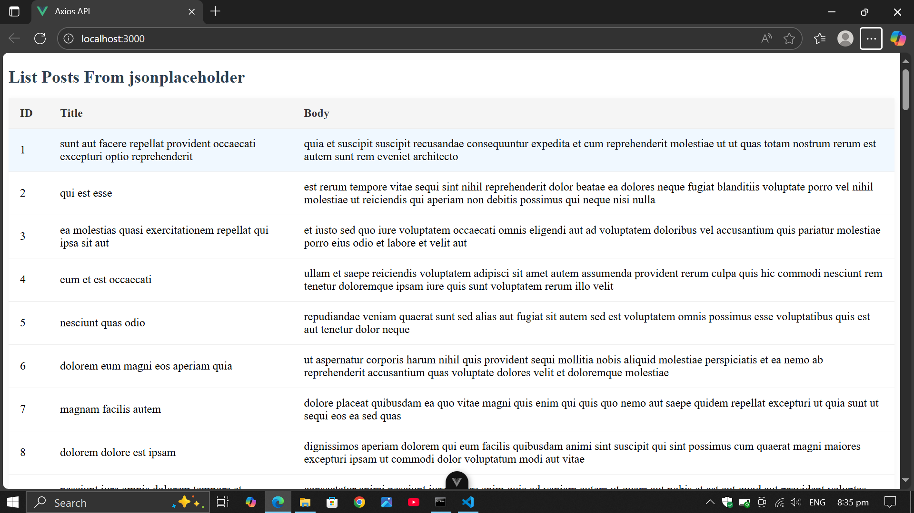

# VueAxiosAPI

A simple Vue 3 project using Vite and Axios to fetch and display data from a public JSON API in a styled table.

## Features

- Vue 3 with Vite for fast development
- Axios for HTTP requests
- Fetches posts from [JSONPlaceholder](https://jsonplaceholder.typicode.com/)
- Clean, responsive table design
- Modular CSS for easy customization

## Recommended IDE Setup

- [VSCode](https://code.visualstudio.com/)
- [Volar](https://marketplace.visualstudio.com/items?itemName=Vue.volar) (disable Vetur if installed)

## Getting Started

### 1. Clone the repository

```sh
git clone https://github.com/AlfredOfficial/vueaxiosapi.git
cd vueaxiosapi
```

### 2. Install dependencies

```sh
npm install
```

### 3. Run the development server

```sh
npm run dev
```

The app will be available at [http://localhost:3000](http://localhost:3000) (if you set the port to 3000).

### 4. Build for production

```sh
npm run build
```

## Project Structure

```
vueaxiosapi/
├── src/
│   ├── components/
│   │   └── List.vue
│   │   └── List.css
│   ├── App.vue
│   └── main.js
├── vite.config.js
├── package.json
└── README.md
```

## Usage

- The main component `List.vue` uses Axios to fetch posts and displays them in a styled table.
- Styles for the table are in the `List.vue`.

## Customization

- To use a different API, update the Axios URL in `List.vue`.
- Modify `List.css` for custom table styles.

## License

## Screenshot

The image below shows the application in action. It displays a list of posts fetched from the JSONPlaceholder API, presented in a clean and responsive table format. Each row shows the post's ID, title, and body, demonstrating how data from an external API can be integrated and styled in a Vue 3 project.

